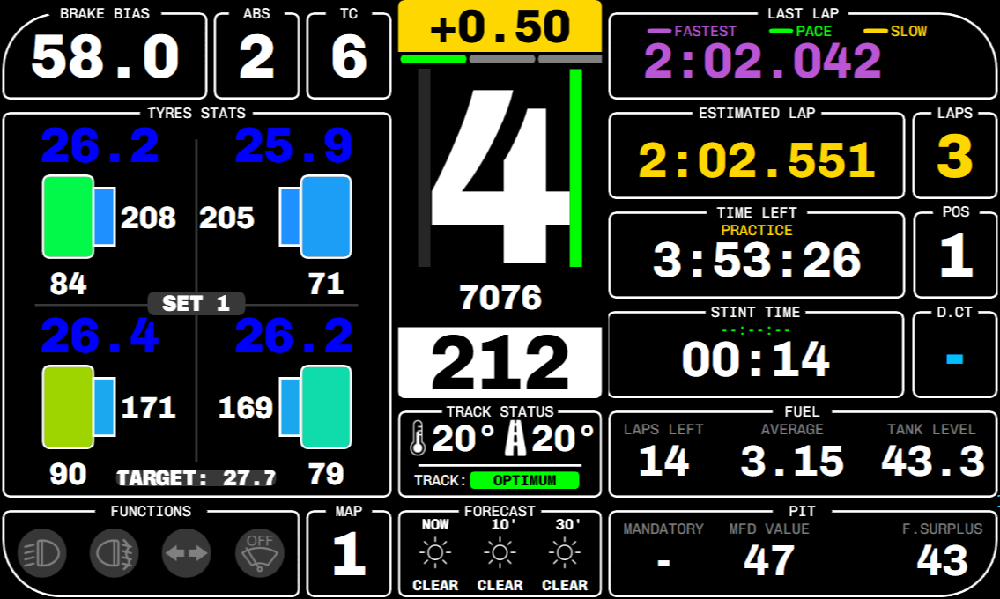

# Adora-Dash
AdoraDash is a meticulously crafted SimHub Dashboard tailored for passionate SimRacing enthusiasts, offering an array of impressive features. It serves as a completely free and valuable asset for your day-to-day racing experiences.

**Presently, AdoraDash fully supports Assetto Corsa Competizione and other sims like Asseto Corsa, Automobilista 2, iRacing, rFactor 2.
The ongoing development stage will see the integration of additional simulators, alongside the periodic delivery of new features.**

## Documentation and Installation
You can find the official documentation here: [Documentation table of contents](/doc/TOC.md)

## Discord Community
Join the vibrant AdoraDash community on Discord!

👉 [AdoraDash Discord Server](https://discord.gg/2yNzuRc62S) 👈

## Disclaimer
All trademarks, logos, and brand names remain the property of their respective owners. The use of company, product, and service names in this application is purely for identification purposes. The inclusion of these names, trademarks, and brands does not imply endorsement unless explicitly stated.

This work is licensed under the [Creative Commons Attribution-NonCommercial-ShareAlike 4.0 International License](https://creativecommons.org/licenses/by-nc-sa/4.0/).
